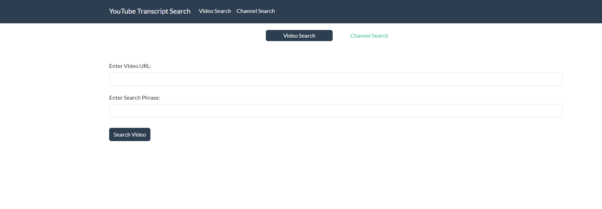
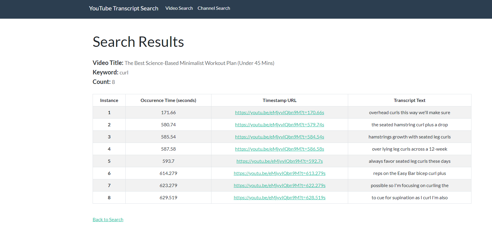
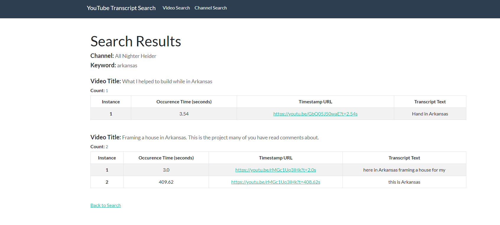

<!-- ABOUT THE PROJECT -->
## Overview

This project provides a simple, user-friendly method of searching within a YouTube video or over an entire channel for a keyword. Rather than watching the entire video over again from the beginning to recall a key portion of the video, simply use this tool to quickly search through the video for the keyword. The program will display a timestamp URL link to the part of the video where the content creator discussed the desired topic, if such a point exists in the video. 


### Built With

* [![Flask][Flask.py]][Flask-url]
* [![Python][Python.py]][Python-url]
* [![Bootstrap][Bootstrap.com]][Bootstrap-url]


<!-- GETTING STARTED -->
## Getting Started

The easiest way to run this program is to install flask and run locally. Download the required python libraries, clone the repo, and then run app.py and head over to http://127.0.0.1:5000 using your browser of choice.

### Prerequisites

The program relies on the following libraries to implement the keyword search functionality:

* youtube_transcript_api
  ```sh
  pip install youtube_transcript_api
  ```

* pytube
  ```sh
  pip install pytube
  ```

* scrapetube
  ```sh
  pip install scrapetube
  ```

* requests
  ```sh
  pip install requests
  ```

* pandas
  ```sh
  pip install pandas
  ```

### Installation

1.  Clone the repo
    ```sh
    git clone https://github.com/novaxc/youtube_transcript_search.git
    ```
2. Install Flask
   ```sh
   pip install Flask
   ```


<!-- USAGE EXAMPLES -->
## Usage

### Main Search Page

The main page consists of two text input boxes, one for the youtube or channel URL and another for the keyword. There is also the option to switch between searching for a keyword within a single YouTube video or within all the videos of a particular channel.


<p style="margin-bottom: 5px;"></p>

### Video Search Results

This page displays the keyword search results within a single video. Each keyword hit has an associated timestamp (in seconds) where the keyword was found, a timestamp URL which pulls up the video 1 second before the keyword is spoken, and an excerpt of the transcript which provides context into what the YouTuber was talking about before and after the keyword was spoken.


<p style="margin-bottom: 5px;"></p>

### Channel Search Results

The channel search results pages displays keyword search results in much the same way as the video search results page with the same keyword occurrence timestamp, timestamp URL to the keyword in the video, and an excerpt of the portion of the transcript where the keyword was found. The only difference is every video in the channel is searched for the keyword as opposed to searching over a single video. If the keyword is not found in a particular video in the channel, it is not included in the search results for the sake of conserving screenspace. This differs from the video search results where there is an indication that the keyword was not found for the particular video. If the keyword was not found in any of the channel's videos, the results page will indicate no keyword hits were found by displaying the channel name and a count of zero.


<p style="margin-bottom: 5px;"></p>


<!-- CONTACT -->
## Contact

Brett Rastatter - https://linkedin.com/in/brett-rastatter-677812126

Project Link: [https://github.com/novaxc/youtube_transcript_search](https://github.com/novaxc/youtube_transcript_search)


<!-- MARKDOWN LINKS & IMAGES -->
<!-- https://www.markdownguide.org/basic-syntax/#reference-style-links -->
[Flask.py]: https://img.shields.io/badge/Flask-000000?style=for-the-badge&logo=flask&logoColor=white
[Flask-url]: https://flask.palletsprojects.com/
[Python.py]: https://img.shields.io/badge/Python-3776AB?style=for-the-badge&logo=python&logoColor=white
[Python-url]: https://www.python.org/
[Bootstrap.com]: https://img.shields.io/badge/Bootstrap-563D7C?style=for-the-badge&logo=bootstrap&logoColor=white
[Bootstrap-url]: https://getbootstrap.com
